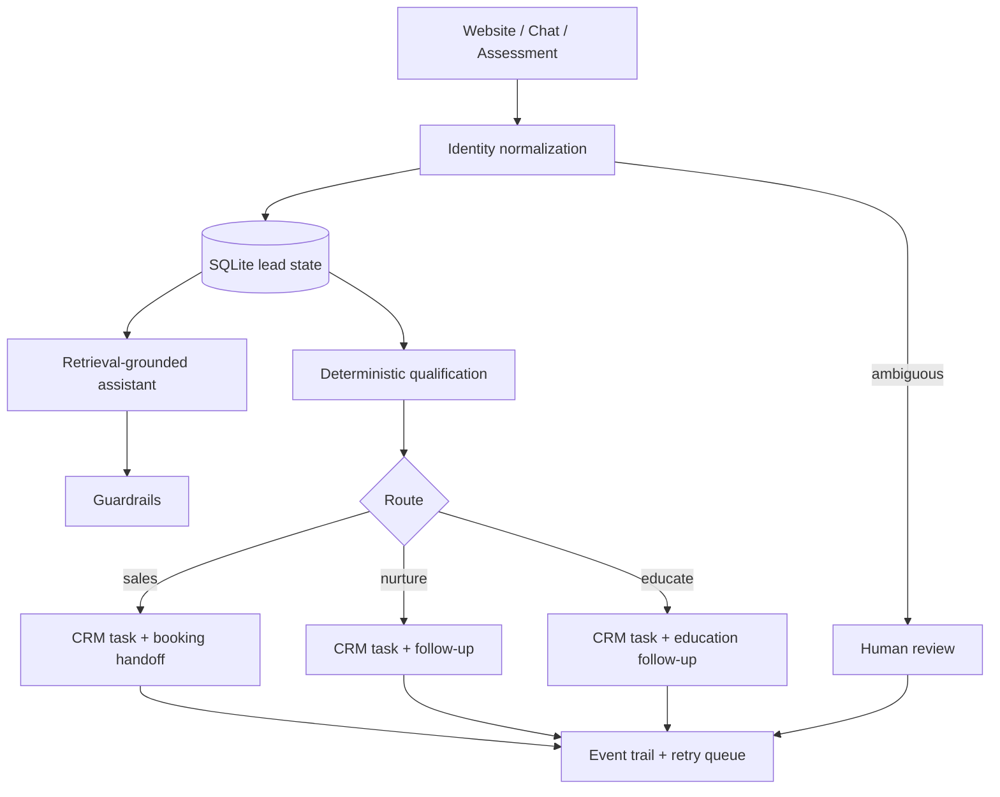

# AI Lead Operations — End-to-End Sales Workflow Automation

This repository is a runnable engineering showcase for an AI-assisted lead-operations workflow. It demonstrates how a website, chat conversation, and assessment can become a traceable lead record, a deterministic route, and coordinated operator work across CRM, scheduling, follow-up, and human review boundaries.

The public demo is intentionally synthetic. It contains no production credentials, customer data, private infrastructure identifiers, proprietary prompts, commercial thresholds, or copied operating content. The fictional product domain is **OrbitDesk**, a workflow hub for boutique service teams.

## Architecture



## What was manual vs automated

| Before automation | Showcase behavior |
| --- | --- |
| A person copied details between intake, chat, and a CRM | Intake and identity resolution write one local lead record |
| A person interpreted readiness inconsistently | A transparent deterministic rule set selects sales, nurture, or educate |
| A person chased failed downstream actions | Adapter jobs record failure and can be retried |
| A person had to reconstruct what happened | The event trail records intake, route, adapter, and review events |
| Ambiguous identities were easy to merge incorrectly | Conflicts stop automation and create a human-review action |

## AI vs deterministic responsibilities

The retrieval-grounded assistant boundary is explicit in `lead_ops/assistant.py`. The default local responder models a model-backed generation step using a small fictional knowledge base, returns source identifiers, and passes the draft through guardrails that reject unsupported numeric claims and prohibited guarantees. It is deliberately local so the primary demo needs no model key; a real model client could implement the same boundary later.

The assistant does not decide eligibility, route a lead, merge conflicting identities, or create a commercial promise. Those responsibilities stay in deterministic Python modules and explicit operator-review paths.

## Integration architecture

The workflow depends on interfaces rather than vendor credentials:

- a local SQLite system of record for lead state, events, and retryable jobs;
- a CRM adapter for an operator task;
- a scheduling adapter for a sales handoff;
- a follow-up adapter for nurture or education;
- a human-review adapter for identity conflicts and exceptions.

The default adapters are local mocks, so the primary demo needs no external account. A production implementation could replace an adapter without changing qualification or the local event model.

## Reliability and governance

- The local lead record is written before downstream work is attempted.
- Failed adapter work remains visible as a retryable job; local qualification truth is not discarded.
- Repeated failures emit an operator-attention event.
- Synthetic provenance is applied by the demo harness, while API intake defaults to human provenance.
- Identity matches are normalized by email, phone, or session. Email and phone matches pointing to different records create a review case.
- Feature flags control CRM, booking, follow-up, and human-review activation.
- The API exposes only local demo data and uses environment-managed configuration for the database path and allowed origins.

This is a portfolio demonstration, not a formal security audit or a claim of production readiness.

## Run the demo

```bash
python3 -m venv .venv
. .venv/bin/activate
pip install -e ".[dev]"
python -m lead_ops.demo
```

The demo prints JSON for:

- a qualified sales route;
- a nurture route;
- an education route;
- an identity conflict requiring review;
- a retrieval-grounded chat response;
- an injected CRM failure followed by a successful retry.

To run the API locally:

```bash
cp .env.example .env
uvicorn lead_ops.main:app --reload
```

Example assessment request:

```bash
curl -X POST http://127.0.0.1:8000/assessment \
  -H 'content-type: application/json' \
  -d '{
    "session_id": "local-session",
    "email": "reader@portfolio.example",
    "fit": "strong",
    "urgency": "soon",
    "budget_alignment": "aligned",
    "decision_authority": true
  }'
```

Useful routes are `POST /chat`, `POST /assessment`, `GET /leads/{lead_id}`, `POST /leads/{lead_id}/retry`, `GET /health`, and `POST /demo/run`. Set `SHOWCASE_OPERATOR_TOKEN` to protect lead inspection and retry routes with the `x-operator-token` header; leave it unset for a local walkthrough.

## Tests and quality checks

```bash
pytest -q
ruff check .
mypy lead_ops
```

The tests exercise public workflow behavior: qualification boundaries, identity conflicts, retrieval sources, guardrails, API intake, local truth after adapter failure, and retry recovery.

## Tech stack

Python 3.11+, FastAPI, Pydantic, SQLite, pytest, Ruff, and mypy. The implementation uses standard-library SQLite and local mock adapters to keep the default path reproducible.

## Known limitations and deliberate exclusions

This repository intentionally excludes real service clients, deployment configuration, customer records, private knowledge, production prompts, vendor identifiers, and commercial eligibility logic. The mock adapters do not send email, create external tasks, or reserve real appointments. The local SQLite store is suitable for a demo and single-process exploration, not a multi-region deployment.

## Development approach and ownership

The project was created through AI-assisted development directed by an operations and automation practitioner. The code is presented as a systems-integration case study rather than a claim that every line was manually authored.

© Siyah Agents. Published for portfolio review only. All rights reserved. This is a sanitized showcase derived from a privately operated production system; production credentials, customer data, commercial rules, and infrastructure details are intentionally excluded.
