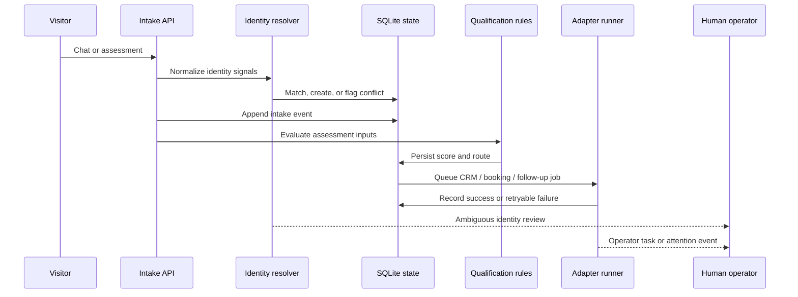

# Architecture and workflow

## Runtime flow

## Boundaries

The assistant and retrieval layer are advisory. Qualification, identity conflict handling, feature flags, persistence, and retry state are deterministic. External systems are represented by adapters so the local workflow can be tested without credentials.
